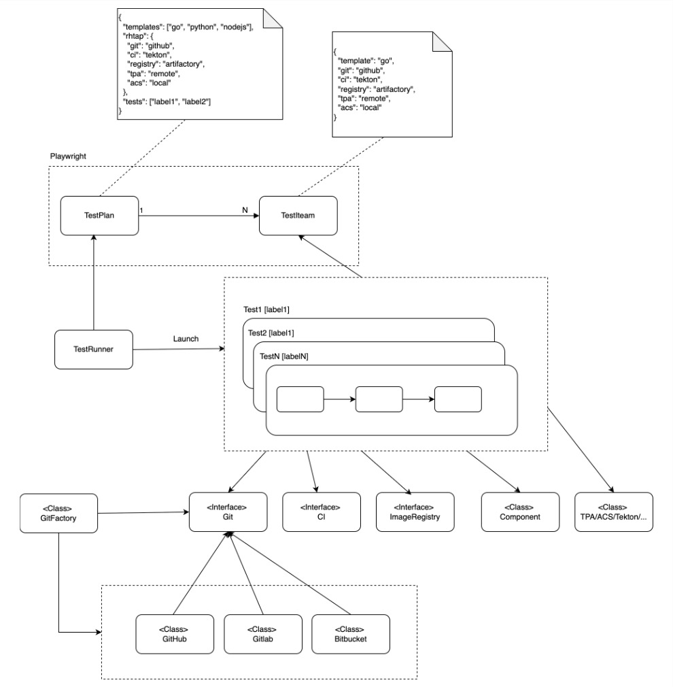

# RHTAP E2E Testing Framework and Tests

## Overview

This project is an end-to-end automation testing framework designed to validate the functionality of the [Red Hat Trusted Application Platform](https://github.com/redhat-appstudio/rhtap-cli) (RHTAP). Built with Playwright and TypeScript, this framework simulates real-world user interactions and backend processes to ensure the reliability and correctness of RHTAP's core features.

## Prerequisites

Before using this testing framework, ensure you have:

* An OpenShift cluster with RHTAP installed and properly configured

* Node.js (v23+)

* ArgoCD CLI installed (Note: Avoid v2.14 due to a known issue: ["FATA[0030] context deadline exceeded"](https://github.com/argoproj/argo-cd/issues/21764))

## Getting Started

1. Install Dependencies
```
# Install dependencies
npm install
```

2. Configure the Test Plan

Copy the testplan.json template from the templates directory to the root directory of the project:

```
cp templates/testplan.json .
```

Modify the testplan.json file to match your testing requirements. Below are the valid values for each field:
```
"templates": ["go", "python", "nodejs", "dotnet-basic", "java-quarkus", "java-springboot"],
"git": ["github", "gitlab", "bitbucket"],
"ci": ["tekton", "jenkins", "gitlabci", "actions"],
"registry": ["quay", "quay.io", "artifactory", "nexus"],
"acs": ["local", "remote"],
"tpa": ["local", "remote"]
```

3. Export Environment Variables
Set the required environment variables running automation tests:

```
export GITHUB_ORGANIZATION="your-github-org"
export GITHUB_TOKEN="your-github-token"
```

Running Tests

Run All Tests

```
npm run test:rhtap
```

Run a Specific Test File

```
npm test -- tests/rhtap/golang.test.ts
```

```
# Run all RHTAP tests
npm run test:rhtap

# Run specific test file
npm test -- tests/rhtap/golang.test.ts


# Generate and View HTML Report
npm run test:report
```


## Development Guide
High Level Digram


Debug Test

Project Structure

Development Commands

```
# Lint code
npm run lint

# Fix linting issues
npm run lint:fix

# Format code with Prettier
npm run format

# Type check
npm run check-types

# Run all validation steps
npm run validate
```