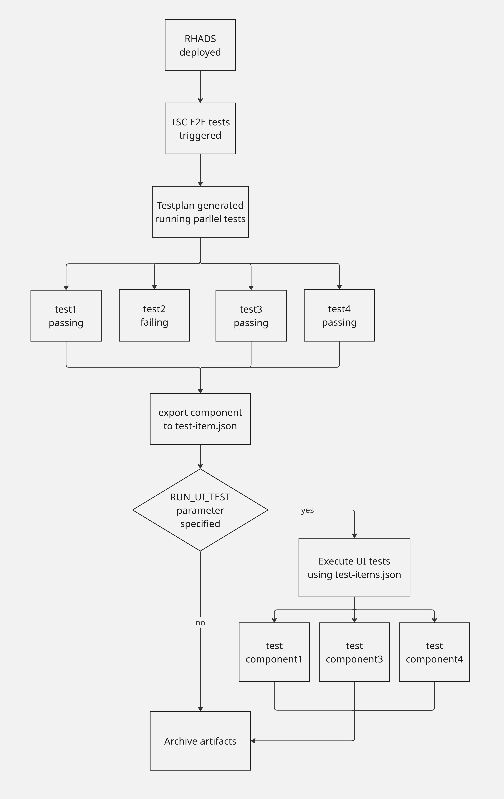

# UI E2E Tests Design and Usage

## Overview

The UI E2E Tests for TSSC are designed to test the web pages user can access. They validate the information shown in the UI and check that all required information is shown properly.

## Design

### How are UI tests integrated to a testing pipeline

As the UI tests are not very stable, we decided to start with a simple UI scenario that will check the component already created by the existing e2e tests.

High level test flow is described in a picture:


### What are UI tests testing

UI tests require a component name and configuration used. The test then opens an appropriate component and checks the relevant UI features based on the component setup. For the release testing, it's required to test (ideally) all combinations of RHADS setup and templates. To save time, we want to run the UI tests in parallel.

To be able to transfer information about component between TSSC E2E backend tests and the UI E2E tests, we use the `./tmp/test-items.json` file. Every component that is created and pass all backend E2E tests is added to the file. Every component has to contain successful pipeline and release pipeline.

Example of `./tmp/test-items.json` file:

```
{
  "testItems": [
    {
      "name": "go-ucylhmzd",
      "template": "go",
      "registryType": "quay.io",
      "gitType": "github",
      "ciType": "tekton",
      "tpa": "remote",
      "acs": "local"
    },
    {
      "name": "python-aabnedid",
      "template": "python",
      "registryType": "nexus",
      "gitType": "github",
      "ciType": "azure",
      "tpa": "remote",
      "acs": "local"
    }
    ],
  "totalTestItems": 2
}
```


## Running Tests
To run the test, user have to be logged in the cluster in a terminal that runs the tests. The `./tmp/test-items.json` have to be present with components described. Logs, screenshots and videos are generated and saved to `./test-results-ui` folder.

Run all UI test in a terminal:

```
npm run test:ui
```

Run a Playwright UI to run and debug tests:

```
npm run ui
```

## Future plans

Once the simple tests work well, we enable them for the PR checks to run together with backend E2E tests. We would also like to extend the test suite to create a component using the UI, trigger new pipeline run and watch statuses of different processes in the UI.