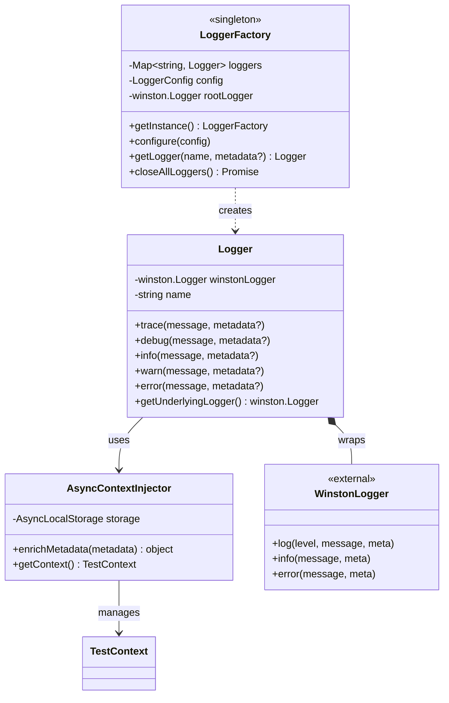

# RHTAP Test Logger Design

## Overview

A Winston-based logger for RHTAP tests that provides clean, type-safe logging with automatic test context injection and flexible output formats.

**Key Features**:
- **Template Literal Logging**: Modern JavaScript template literals - `logger.info(\`User ${username} logged in\`)`
- **Zero-Configuration Context**: Test context (project name, worker ID) automatically injected via AsyncLocalStorage
- **Dual Formats**: Human-readable text for console, structured JSON for files (ELK/Splunk ready)
- **Simplified Architecture**: Direct Winston integration without unnecessary abstraction layers
- **Type-Safe**: Full TypeScript support with familiar logging API


## Core Principles

1. **Automatic Basics + Optional Enhancements**
   - Test identification requires zero user effort (automatic via AsyncLocalStorage)
   - Context propagates through async call chains without manual threading
   - Rich metadata available when needed, automatic when possible

2. **Simple, Direct Architecture**
   - Thin wrapper around Winston - no unnecessary abstraction layers
   - Direct access to Winston logger when needed via `getUnderlyingLogger()`
   - Easy to understand, easy to debug

3. **Developer Experience First**
   - Modern JavaScript template literals for string interpolation
   - Type-safe throughout with TypeScript interfaces
   - Minimal configuration required to get started

## Architecture Overview

### System Design

The logger uses a **simplified composite pattern** with direct Winston integration:



**Component Responsibilities**:

1. **Logger**: Thin wrapper around Winston that adds context injection
2. **LoggerFactory**: Creates and manages Logger instances, configures Winston
3. **AsyncContextInjector**: Enriches logs with test context from AsyncLocalStorage
4. **Winston**: Handles actual log formatting and output (transports, formatters)

### Key Components

**LoggerFactory (Singleton)**:
- Creates and manages Logger instances
- Configures Winston root logger and transports
- Provides `LoggerFactory.getLogger(name)` API

**Logger (Wrapper)**:
- Thin wrapper around Winston logger
- Automatically injects test context into all logs
- Provides typed log level methods: `trace`, `debug`, `info`, `warn`, `error`
- Supports two logging styles: template literals, structured metadata

**AsyncContextInjector**:
- Retrieves test context from AsyncLocalStorage
- Merges user metadata with auto-injected context
- Context fields (projectName, worker) added automatically

**Winston Logger (External)**:
- Handles log formatting (text vs JSON)
- Manages transports (console, file rotation)
- Provides underlying logging infrastructure

## Installation

### Dependencies

The logger requires the following packages:

```bash
npm install winston winston-daily-rotate-file
npm install --save-dev @types/winston
```

Package dependencies:
```json
{
  "dependencies": {
    "winston": "^3.11.0",
    "winston-daily-rotate-file": "^5.0.0"
  },
  "devDependencies": {
    "@types/winston": "^2.4.4"
  }
}
```

## Configuration

The logger provides three configuration methods with clear priority: defaults → programmatic → environment variables.

### 1. Default Configuration

The logger includes sensible defaults in `src/logger/config/loggerConfig.ts`:

```typescript
import { LoggerConfig } from '../types/logger.types';

export const loggerConfig: LoggerConfig = {
  level: 'debug',

  console: {
    enabled: true,
    level: 'info',
    format: 'text',      // Human-readable for development
    colorize: true,
    prettyPrint: true,
    timestamp: true,
  },

  file: {
    enabled: true,
    level: 'debug',
    format: 'json',      // Structured for log aggregation
    directory: './logs',
    filename: 'test-%DATE%.log',
    datePattern: 'YYYY-MM-DD',
    maxSize: '20m',
    maxFiles: '14d',
  },

  exceptionHandling: {
    handleExceptions: true,
    handleRejections: true,
  },
};
```

**These defaults work out-of-the-box** - no configuration needed to start logging.

### 2. Programmatic Configuration

Override defaults at application startup:

```typescript
import { LoggerFactory } from './src/logger/logger';

// Configure once at startup
LoggerFactory.configure({
  level: 'info',
  console: {
    enabled: true,
    format: 'text',
  },
  file: {
    enabled: true,
    directory: './app-logs',
    maxSize: '50m',
  },
});
```

### 3. Environment Variables

Override configuration at runtime without code changes:

```bash
# Global Settings
LOG_LEVEL=debug                # trace|debug|info|warn|error

# Console Transport
LOG_CONSOLE_ENABLED=true       # true|false
LOG_CONSOLE_LEVEL=info         # Log level for console
LOG_CONSOLE_FORMAT=text        # text|json

# File Transport
LOG_FILE_ENABLED=true          # true|false
LOG_FILE_LEVEL=debug           # Log level for files
LOG_FILE_FORMAT=json           # text|json
LOG_FILE_DIRECTORY=./logs      # Directory path
LOG_FILE_MAX_SIZE=20m          # Max file size (e.g., 20m, 100k)
LOG_FILE_MAX_FILES=14d         # Retention (e.g., 14d, 10 files)
```

**Priority Order**: Environment variables override programmatic configuration, which overrides defaults.

## Playwright Integration

The logger is integrated with Playwright to provide automatic context injection. Here's how it works:

### Integration Flow

This shows how the logger is configured when the Playwright test suite starts:


**How It Works**:
- Runs **once** at test suite initialization
- `playwright.config.ts` defines `globalSetup: './global-setup.ts'`
- Playwright framework executes global setup before any tests run
- `global-setup.ts` loads configuration from environment variables
- `LoggerFactory.configure()` sets up Winston transports (console + file)
- LoggerFactory singleton is ready for all tests

### Test Context Storage

The test context storage is defined in `src/logger/context/testContext.ts`:

```typescript
import { AsyncLocalStorage } from 'async_hooks';
import { TestContext } from '../types/metadata.types';

// AsyncLocalStorage for test context
export const testContextStorage = new AsyncLocalStorage<TestContext>();

/**
 * Extract test context from Playwright testInfo
 */
export function extractTestContext(testInfo: any): TestContext {
  return {
    projectName: testInfo.project.name,
    worker: testInfo.parallelIndex,
  };
}
```

### Test Fixtures

The logger fixture is configured in `src/utils/test/fixtures.ts`:

```typescript
import { test as base } from '@playwright/test';
import { LoggerFactory, type Logger } from '../../logger/logger';
import { testContextStorage, extractTestContext } from '../../logger/context/testContext';

type TestFixtures = {
  logger: Logger;
};

export const test = base.extend<TestFixtures>({
  logger: async ({}, use, testInfo) => {
    // Extract test context from Playwright
    const context = extractTestContext(testInfo);

    // Create logger instance
    const logger = LoggerFactory.getLogger('test');

    // Run test with context in AsyncLocalStorage
    await testContextStorage.run(context, async () => {
      await use(logger);
    });
  },
});

export { expect } from '@playwright/test';
```

### Using Logger in Tests

Simply import from the fixtures file and use the logger fixture:

```typescript
import { test, expect } from '../utils/test/fixtures';

test('should create component', async ({ logger }) => {
  // Logger automatically provided with context injection
  logger.info("Starting test");

  // All logs automatically include projectName and worker
  logger.info("Test step completed", { step: 'initialization' });
});
```

**No configuration needed** - the logger automatically injects `projectName` and `worker` into every log.

## Usage Guide

### 1. Creating Logger Instances

The first step is creating a logger instance. The approach differs between application code and test code:

#### In Application/Class Code

You create the logger using `LoggerFactory.getLogger()`. There are two options:

**Option A: Class Constructor (Simple)**

Pass the class constructor - logger name becomes the class name:

```typescript
import { LoggerFactory, type Logger } from '../../logger/logger';

export class UserService {
  private readonly logger: Logger = LoggerFactory.getLogger(UserService);
  // Logger name: "UserService"

  async processUser(userId: string) {
    this.logger.info(`Processing user ${userId}`);
  }
}
```

**Option B: Hierarchical String (Recommended)**

Use dot-separated names for logical grouping and grep-friendly filtering:

```typescript
import { LoggerFactory, type Logger } from '../../logger/logger';

export class GithubClient {
  private readonly logger: Logger = LoggerFactory.getLogger('github.client');
  // Logger name: "github.client"

  async ping() {
    this.logger.debug("Pinging GitHub API");
  }
}
```

**Benefits of hierarchical naming**:
- Grep-friendly: `grep "github\\.client" logs.txt` finds all GitHub client logs
- Logical grouping: `github.client`, `github.actions`, `github.repository`
- Consistent module organization

**For utility functions or non-class contexts**:

```typescript
import { LoggerFactory } from '../../logger/logger';

const logger = LoggerFactory.getLogger('utils.validation');

function validateEmail(email: string) {
  logger.debug(`Validating email ${email}`);
}
```

#### In Test Code (Fixture-based)

In Playwright tests, logger is automatically provided by the fixture:

```typescript
import { test, expect } from '../utils/test/fixtures';

test('should create component', async ({ testItem, logger }) => {
  // Logger automatically provided - no need to create it
  // Context (projectName, worker) auto-injected

  logger.info("Starting test");
  const component = await testItem.createComponent('my-app');
  logger.info("Component created", { id: component.id });
});
```

### 2. Logging at Different Levels

The logger provides five log levels (from most to least verbose):

```typescript
const logger = LoggerFactory.getLogger('UserService');

// TRACE: Very detailed debugging (finest-grained)
logger.trace(`Entering method processUser with userId=${userId}`);

// DEBUG: Detailed debugging information
logger.debug(`Cache miss for key ${cacheKey}`);

// INFO: Normal operational events (default level)
logger.info(`User ${username} logged in successfully`);

// WARN: Warning conditions that don't prevent operation
logger.warn(`Retry attempt ${currentAttempt} of ${maxAttempts}`);

// ERROR: Error events requiring attention
logger.error(`Failed to process user ${userId}`, { error: err.message });
```

**When to use each level**:

| Level   | Use Case                                    | Example                           |
|---------|---------------------------------------------|-----------------------------------|
| `trace` | Very detailed debugging, trace execution    | Method entry/exit, loop iterations|
| `debug` | Development debugging, diagnostic info      | Cache hits/misses, data validation|
| `info`  | Normal operational messages                 | Service started, user actions     |
| `warn`  | Potentially harmful situations              | Retries, deprecated API usage     |
| `error` | Failures requiring attention                | Exceptions, failed operations     |

### 3. Template Literal Logging

Use JavaScript template literals for clean, readable log messages:

```typescript
const logger = LoggerFactory.getLogger('OrderService');

// Basic template literal logging
logger.info(`Processing order ${orderId}`);
logger.info(`User ${username} placed order ${orderId}`);

// Multiple variables
logger.info(`Transferring ${amount} from ${fromAccount} to ${toAccount}`);

// Expressions in templates
logger.info(`Cart has ${cart.items.length} items totaling ${cart.total}`);
```

**Output**:
```
2024-01-21 10:30:45 [INFO ] OrderService: Processing order ORD-12345
2024-01-21 10:30:45 [INFO ] OrderService: User alice placed order ORD-12345
```

**Why use template literals?**:
- **Modern JavaScript**: Standard ES6+ syntax
- **Readable code**: `logger.info(\`User ${name}\`)` vs `logger.info("User " + name)`
- **Expression support**: Can include any JavaScript expression `${obj.prop}`
- **Familiar**: Same syntax used throughout JavaScript/TypeScript

### 4. Adding Metadata

Add structured metadata to provide additional context:

#### Simple Metadata

```typescript
logger.info("User logged in", { username, ipAddress });
logger.warn("High memory usage", { currentMB: 850, limitMB: 1024 });
```

**Output**:
```
2024-01-21 10:30:45 [INFO ] UserService: User logged in {username=alice, ipAddress=192.168.1.1, projectName=e2e-go[github-tekton-quay-remote], worker=0}
```

#### Combined: Template Literals + Metadata (Recommended)

Combine template literals for the main message with metadata for additional details:

```typescript
logger.info(`Processing ${count} items from ${source}`, {
  batchId,
  startTime,
  queueDepth
});

logger.error(`Failed to connect to ${host}:${port}`, {
  timeout: 5000,
  retryCount: 3,
  lastError: err.message
});
```

**Output**:
```
2024-01-21 10:30:45 [INFO ] BatchService: Processing 100 items from database {batchId=abc123, startTime=1737269288, queueDepth=42, projectName=e2e-go[github-tekton-quay-remote], worker=0}
```

**Best Practice**: Use template literals for key information (easy to grep), metadata for structured details (easy to analyze).

### 5. Automatic Context Injection

The logger automatically injects test context into every log - **you don't need to configure anything**.

**Auto-Injected Fields**:
- `projectName`: Test project name (e.g., `'e2e-go[github-tekton-quay-remote]'`)
- `worker`: Parallel worker index (e.g., `0`, `1`, `2`)
- `timestamp`: ISO 8601 timestamp (added by Winston formatter)

**How It Works**:
- **AsyncLocalStorage** captures test context from Playwright's `testInfo`
- Context propagates through all async operations automatically
- Logger retrieves context at log time and merges with your metadata
- **Zero configuration** - just call `logger.info()` and context appears

**Example**:

```typescript
// You just write normal logs
logger.info(`Creating component ${componentName}`);

// Output automatically includes context (no extra code needed):
// 2024-01-21 10:30:45 [INFO ] MyTest: Creating component my-app {projectName=e2e-go[github-tekton-quay-remote], worker=0}
```

**Benefits**:
- ✅ No manual context passing through function parameters
- ✅ Works across async boundaries automatically
- ✅ Every log shows which test and worker produced it
- ✅ Perfect for debugging parallel test failures

## Log Format

### Text Format (Console Default)

Single-line format optimized for human readability:

```
2024-01-21 10:30:45.804 [INFO ] github.client: Creating component {baseUrl=https://api.github.com, projectName=e2e-go[github-tekton-quay-remote], worker=0}
```

**Features**:
- Grep-friendly single-line format
- `{key=value}` metadata appended to message
- Colorized log levels (console only)
- ISO 8601 timestamp with milliseconds

**Use Cases**:
- Development console output
- CI/CD build logs
- Quick debugging with grep/awk

### JSON Format (File Default)

Structured format for log aggregation systems:

```json
{
  "timestamp": "2024-01-21T10:30:45.804Z",
  "level": "info",
  "logger": "github.client",
  "message": "Creating component",
  "baseUrl": "https://api.github.com",
  "projectName": "e2e-go[github-tekton-quay-remote]",
  "worker": 0
}
```

**Features**:
- Standard field names (`logger`, `message`, not `label`, `msg`)
- Proper ISO 8601 timestamps
- Machine-parseable for analytics
- Compatible with ELK, Splunk, Datadog

**Use Cases**:
- Log aggregation and analysis
- Metrics and monitoring dashboards
- Long-term log storage
- Compliance and audit trails

## Advanced Usage

### Accessing Underlying Winston Logger

For advanced Winston features not exposed by the Logger wrapper:

```typescript
const logger = LoggerFactory.getLogger('MyService');

// Get underlying Winston logger
const winstonLogger = logger.getUnderlyingLogger();

// Use Winston-specific features
winstonLogger.profile('expensive-operation');
// ... expensive operation ...
winstonLogger.profile('expensive-operation');
```

**Use Cases**:
- Profiling with Winston's built-in profiler
- Using Winston plugins or features not in the wrapper
- Migration from direct Winston usage

### Cleanup on Shutdown

Close all loggers and flush pending logs:

```typescript
import { closeAllLoggers } from './src/logger/logger';

process.on('SIGTERM', async () => {
  await closeAllLoggers();
  process.exit(0);
});
```

## Migration Guide

### Migrating from Placeholder-based Logging

If upgrading from the older `{}` placeholder format:

**Before**:
```typescript
logger.info("Processing user {}", userId);
logger.info("User {} placed order {}", username, orderId);
```

**After**:
```typescript
logger.info(`Processing user ${userId}`);
logger.info(`User ${username} placed order ${orderId}`);
```

**Key Changes**:
- Replace `{}` placeholders with `${variable}` template literal syntax
- Wrap log messages in backticks (\`) instead of quotes
- Variables/expressions go inside `${...}`
- Metadata object still goes as second parameter

## Architecture Changes from Previous Version

The logger has been simplified from the previous implementation:

**Removed Components**:
- ❌ `ILogTransport` interface - direct Winston integration instead
- ❌ `WinstonTransport` adapter - unnecessary abstraction layer
- ❌ `IMessageFormatter` interface - Winston handles formatting
- ❌ `ParameterizedFormatter` class - template literals replace placeholder parsing
- ❌ `verify-logger.ts` - removed obsolete verification script

**Simplified Architecture**:
- ✅ Direct Winston wrapper in `Logger` class
- ✅ Single responsibility: context injection + Winston delegation
- ✅ Fewer moving parts, easier to understand and debug
- ✅ Modern JavaScript template literals instead of custom parsing
- ✅ Access to underlying Winston logger when needed

**Benefits**:
- Simpler codebase (removed ~250 lines of abstraction code)
- Easier to debug (direct Winston integration)
- Modern syntax (template literals)
- Better performance (no placeholder parsing overhead)
- More maintainable (fewer components to manage)
